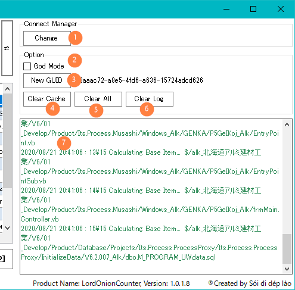

# Rules 
1. Mỗi yêu cầu công việc tương ứng với 1 workItem
Tên workItem phải thống nhất với module nội bộ (schedule,BTMS,QAMS,...)
2. Khi duplicate PG thì sử dụng chức năng branch source của TFS. Thực hiện theo
[Hướng dẫn Duplicate PG](~/skills\DevelopmentGuide\DuplicateProgram\create-branch.md)

※ Sau khi brach-source thì nhất định phải tạo workItem và checkIn lần đâu.

Không chỉnh sửa source

3. Khi rename file thì phải dùng [Visual Studio]

# Cài đặt

[* Lord Onion Counter](http://172.16.7.102/Measure.App/LordOnionCounter.htm)

[TFPT ](https://marketplace.visualstudio.com/items?itemName=TFSPowerToolsTeam.MicrosoftVisualStudioTeamFoundationServer2015Power)

3rd: (không cần cài)
1. TFS SDK
2. CLOC

# Hướng dẫn thao tác.

## Màn hình chính

① TextBox để input workItem.

② Get thông tin changeset, tìm file đối tượng từ WorkItem ①

③ Tên WorkItem ①

④ Danh sách changeset của WorkItem (có thể edit rồi xử lýlại theo list này)

⑤ Tìm file đối tượng theo ④

⑥ Danh sách file đối tượng, nếu không tính Loc file này thì hãy tháo check.

⑦ Gắn check tất cả các dòng tại grid

⑧ Tháo check tất cả các dòng tại grid

⑨ Download file đối tượng và tính LOC

⑩ Thoát PG.

⑪ Ẩn hiện Sidebar

## SideBar
 

① mặc định thì đang connect đến TFS của PROCESS collection.

Trường hợp muốn TFS server thì hãy click ①

② active God Mode. Chi tiết bên dưới.

③ GUID để tạo folder download source.
hiện tại đang sử dụng folder bên dưới đểm lưu tempData
>%temp%\LOC\「GUID」

④ Xóa folder ③

⑤　Xóa folder temp của Program
>%temp%\LOC

⑥ Clear log ⑦

⑦ Logger của PG

# Các cách vận dụng

## Normal Mode

① Input WorkItem của PG cần tính LOC

② Get file đối tượng

③ Thực hiện đếm LOC

### Trường hợp Không branch source thì làm như thế nào?

xóa Changeset checkin source base (Duplicate mà không chỉnh sửa gì so với source tham khảo)

Thường là changeset đầu tiến, nếu nhiều hơn thì tự lựa ra (Chơi ngu có thưởng  :laughing:  :laughing:  :laughing:  :laughing: )

Nếu không thể tách riêng theo changeset thì làm theo hướng dẫn tiếp theo.

### Trong cùng changeset mà có file checkin nhầm thì làm như thế nào?

Nếu file không sửa gì => tháo check tại grid.
Nếu file có sửa, nhưng không tính base được => trên grid có column 「base Path」 và 「Base Cs」 hãy edit bằng tay.(Lại có thưởng  :laughing: )

## God Mode

Nhập workitem sau đó đếm loc luôn, edit Changeset, file đối tượng

# Màn hình hiển thị report

① Summary của Program

② Thông tin đếm LOC (Không quan trọng, NEXT)

③ Chi tiết theo đơn vị File

④ Base LOC để điền vào WMS 

⑤ New LOC để điền vào WMS 

---
DONE!