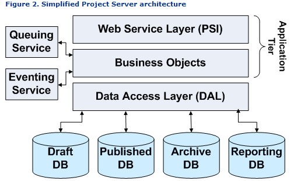

Demo để connect và get data từ Server MS Project.

Sử dụng:
* Project 2007 SDK
* Project Server Interface (PSI)

# Project 2007 SDK

Project 2007 SDK cung cấp các thư viện để thao tác với MS Project Server.

Hiện tại đã ngừng support bởi MS.

Được phát triển trên Microsoft .NET Framework 3.0. và Windows SharePoint Services 3.0

## Link cài đặt:
* [pj12ProjectSDK](https://svn2.fujinet.vn:8507/svn/proces.s/trunk/TEAM2.3_DOCs/99_Others/Component/pj12ProjectSDK.exe)

## Document:
Hiện tại MS không support SDK này nữa. nên rất ít tài liệu tại trang chủ.

Khi install SDK, sẽ có tài liệu đi kèm (định dạng *.chm), source sample,...
* \Project 2007 SDK\PJSDK2007.chm
* \Project 2007 SDK\Schemas\Reporting and Cube\pj12ReportingDB.chm
* \Project 2007 SDK\Code Samples\ERPConnector\doc\ERPConnectorComponents.chm
* \Project 2007 SDK\Schemas\Project Portfolio Server\Project Portfolio Server 2007 DB Reference AccountData.chm
* \Project 2007 SDK\Schemas\Project Portfolio Server\Project Portfolio Server 2007 DB Reference AccountIndex.chm

## Kiến trúc của Project Web Access Server (PWA)

Chi tiết thì đọc tại [PJSDK2007.chm].[Project Server Architecture]

# Project Server Interface (PSI)

là webservice cung cấp các webmethod để thao tác trên MS Project Server.

## Kiến trúc của PSI

Chi tiết thì đọc tại [PJSDK2007.chm].[Introduction to the PSI Web Services]

## Các Services của PSI

| Service            | Description                                                                                                                                                                                                                                                                                                                                                                                                                                                                                                    | Note |
| ------------------ | -------------------------------------------------------------------------------------------------------------------------------------------------------------------------------------------------------------------------------------------------------------------------------------------------------------------------------------------------------------------------------------------------------------------------------------------------------------------------------------------------------------- | ---- |
| Admin              | Includes methods that are used on the Project Server Administration pages in Project Web Access. Defines fiscal years. Manages statusing and currency settings, reporting periods, the audit log, and Microsoft Active Directory directory services.                                                                                                                                                                                                                                                           |
| Archive            | Includes methods for managing backup and restoration of projects, security categories, custom fields, resources, system settings, views, and the enterprise global project. Reads and updates the archive schedule. Archives all projects or deletes specified archived projects. Back up to the Archive database and restore to the Published database.                                                                                                                                                       |
| Authentication     | Includes methods for internal use only by Project Professional and Project Web Access. Access to the Authentication Web service is available only through the SSP URL. For more information, see Internal PSI Web Services.                                                                                                                                                                                                                                                                                    |
| Calendar           | Manages enterprise calendar exceptions. Checks out and checks in resource calendars. Creates, deletes, lists all, updates, or returns calendar exceptions.                                                                                                                                                                                                                                                                                                                                                     |
| CubeAdmin          | Manages OLAP cube settings. Gets Analysis Server, database status, and list of cubes. Puts a Cube Build Service request on the queue. Reads and updates calculated member definitions and field settings for dimensions and measures in the cube.                                                                                                                                                                                                                                                              |
| CustomFields       | Manages enterprise custom fields. Checks out, checks in, reads, creates, deletes, and updates.                                                                                                                                                                                                                                                                                                                                                                                                                 |
| Events             | Manages Project Server event handler associations. Reads the list of Project Server events, event handler associations for a specific event, or all event handler associations. Creates, updates, and deletes event handler associations.                                                                                                                                                                                                                                                                      |
| LoginForms         | Provides the Login and Logoff methods with Project Server authentication. Access to the LoginForms Web service is available only with Project Web Access URLs.                                                                                                                                                                                                                                                                                                                                                 |
| LoginWindows       | Provides the Login and Logoff methods with Windows authentication. Access to the LoginWindows Web service is available only with Project Web Access URLs.                                                                                                                                                                                                                                                                                                                                                      |
| LookupTable        | Manages lookup tables, multilanguage lookup tables, and their corresponding code masks. Checks out, checks in, reads, creates, deletes, and updates.                                                                                                                                                                                                                                                                                                                                                           |
| Notifications      | Manages alerts and reminders. Gets, sets, registers, or unregisters notifications.                                                                                                                                                                                                                                                                                                                                                                                                                             |
| ObjectLinkProvider | Manages Web objects and links for documents and list items on Windows SharePoint Services sites. Creates, deletes, or reads project, project-linked, task, or task-linked Web objects on Windows SharePoint Services sites.                                                                                                                                                                                                                                                                                    |
| Project            | Manages projects. Checks out, checks in, creates, deletes, reads, or updates projects in the Draft or Published database. Puts a message on the queue for publishing.                                                                                                                                                                                                                                                                                                                                          |
| Creates            | or deletes entities within projects (tasks, resources, assignments, and so forth). Gets information about or updates the project team or workspace address. Gets project status, a list of projects in the Draft database, all summary tasks, tasks available for assignment to a specified resource, or all projects where a resource has assignments.                                                                                                                                                        |
| Creates            | and manages commitments, creates lightweight projects from Windows SharePoint Services task lists, or finds project/master project relationships.                                                                                                                                                                                                                                                                                                                                                              |
| PWA                | Contains many methods that are optimized for Project Web Access, including the methods for task update approval rules and for managing status reports. The Project Web Access methods are often specialized and somewhat redundant compared to equivalent methods in other PSI Web services. Project Web Access methods use or return many of the same datasets as the other PSI methods.                                                                                                                      |
| Access             | to the PWA Web service is available only through the SSP URL. The PWA methods are not supported for third-party development. For more information, see Internal PSI Web Services.                                                                                                                                                                                                                                                                                                                              |
| QueueSystem        | Manages the Project Server queue. Gets job count, job and job group wait time, status of all jobs, specified jobs, jobs owned by the caller, or jobs for specified projects. Manages job correlation and configures the queue.                                                                                                                                                                                                                                                                                 |
| Resource           | Manages enterprise resources. Checks out, checks in, updates, or creates resources or Project Server users and their authorization settings; finds resources by name or GUID; reads resource or user data, the resource breakdown structure (RBS) and related security information; gets all assignments for a resource; and resets user passwords.                                                                                                                                                            |
| ResourcePlan       | Manages resource plans. Checks out, checks in, creates, deletes, publishes, reads, and updates resource plans.                                                                                                                                                                                                                                                                                                                                                                                                 |
| Security           | Manages security templates, security categories and field access codes, organizational and global permissions, and user and group permissions.                                                                                                                                                                                                                                                                                                                                                                 |
| Statusing          | Manages status updates and assignments. Applies status updates or approvals, submits status updates, sets summary information for submitted updates, deletes approved status updates or approval history for a specified user, or deletes all status information for a set of projects. Creates, gets, or delegates assignments; sets assignment work duration. Gets new assignments for the current user; gets assignment or task transaction history, the timephased actuals, or the summary task hierarchy. |
| Previews           | or imports timesheet data, or reads a user's working and nonworking schedule. Finds pending status updates, information for submitted updates, or a transaction record of changes in a submitted update. Reads team status.                                                                                                                                                                                                                                                                                    |
| TimeSheet          | Manages timesheets. Creates, deletes, submits, updates, reads, or recalls timesheets. Finds timesheets that are late or pending approval; finds timesheets by date or period. Gets list of timesheet approvers. Preloads actuals and validates a timesheet line.                                                                                                                                                                                                                                               |
| View               | The View Web service is designed for use only within Project Web Access. Methods in the View class manage views and view reports and read fields in views.                                                                                                                                                                                                                                                                                                                                                     |
| Access             | to the View Web service is available only through the SSP URL. The View methods are not supported for third-party development. For more information, see Internal PSI Web Services.                                                                                                                                                                                                                                                                                                                            |
| WinProj            | The WinProj Web service is a Project Server system entity designed for use only by Project Professional. Third-party developers should not use WinProj methods for programming with Project Server.                                                                                                                                                                                                                                                                                                            |
| Some               | WinProj methods use datasets such as ProjectRelationsDataSet and ResourceDataSet that the Project and Resource Web services also use, but require specific properties and functions in Project Professional.                                                                                                                                                                                                                                                                                                   |
| Access             | to the WinProj Web service is available only through the SSP URL. The WinProj methods are not supported for third-party development. For more information, see Internal PSI Web Services.                                                                                                                                                                                                                                                                                                                      |
| WssInterop         | Manages project workspaces. Creates and deletes workspaces. Gets information about and updates the Windows SharePoint Services settings and administration sites. Synchronizes and updates the workspace site memberships and groups with Project Server users.                                                                                                                                                                                                                                                |

# Demo

## Dev Env

* .NET 4.6.2
* Winform
* Visual Studio 2019
* C# Language

## Dependencies Lib

* ObjectListView
* AutoMapper.Extensions.Microsoft.DependencyInjection
* Microsoft.Extensions.DependencyInjection.Abstractions
* Microsoft.Office.Project.Server

## Cấu trúc source

1. Program.cs
 Là Startup object.
 thực hiện đăng ký các service (DI), AutoMapper, Mutex,...
 Xác định View được khởi động.

1. MySettings.cs
 Kế thừa từ ApplicationSettingsBase
 Lưu trữ setting của Project

1. MappingProfile.cs (AutoMapper)
 Chứa thông tin để mapping các Object.

1. Web References
 Refernces đế PSI để get các interface.
 Sẽ được kế thừa tại Utilts

1. Utilts
 kế thừa từ [Web References]
 định nghĩa các request đến PSI

1. Core
 Các xử lý common, Extension,...

1. View - ViewModel - Model
 Giao diện và model của các form.

1. Entities
  Object để truyền nhận data giữa các Layer.

1. Data
 Chứa các reporsitoru để Get data từ PSI
  sử dụng class từ [Utilts/*]

## Login

 PSI đang cung cấp 2 method để login.
* WinAuth
* FormAuth

  Demo này chỉ sử dụng WinAuth
 Được triển khai tại PsiRepository.P12Login

## Các data thông dụng

### ProjectDataset

#### Method :   ProjectDerived.ReadProjectEntities
* get thông tin chi tiết của 1 Project
* Web reference: http://ServerName/ProjectServerName/_vti_bin/psi/Project.asmx
#### Param :
* System.Guid projectUid
	 GUID của Project cần get.
* int ProjectEntityType
	 Loại data cần get.
	 Đã chuẩn bị sẵn enum dưới dạng flagAttribute. P2k7.Entities.ProjectEntityType

| Name                             | Value |
| -------------------------------- | ----- |
| Project                          | 1     |
| Task                             | 2     |
| Resource                         | 4     |
| Assignment                       | 8     |
| Dependency                       | 16    |
| ProjectCustomFields              | 32    |
| TaskCustomFields                 | 64    |
| ResourceCustomFields             | 128   |
| AssignmentCustomFields           | 256   |
| AssignmentCore                   | 512   |
| ProjectDefaults                  | 1024  |
| AssignmentOwnerDefaults          | 2048  |
| AssignmentCustomFieldsNoRolldown | 409   |
 

* DataStoreEnum dataStore
	 nguồn get data.

| Name           | value | Description        |
| -------------- | ----- | ------------------ |
| WorkingStore   | 1     | Published database |
| PublishedStore | 3     | Reporting database |
| ReportingStore | 2     | Archive database   |
| VersionsStore  | 0     | Draft database     |

#### Return

* ProjectDataSet
	*  kế thừa từ System.Data.DataSet
* một loại entity chỉ định tại ProjectEntityType sẽ tương ứng 1 table
	* Kế thừa từ System.Data.DataTable
	* cung cấp các method để get kiểu dữ liệu của Column, tên column,...
* Mỗi row
	* Kế thừa từ System.Data.DataRow
	* Cung cấp property cho mỗi column để get trị.

#### Image data(chỉ một số table)

### CustomFieldDataSet

#### Method : CustomFieldsDerived.ReadCustomFields
* Get định nghĩa của các customeField.
* Web reference: http://ServerName/ProjectServerName/_vti_bin/psi/CustomFields.asmx

#### Param :
* string xmlFilter
	 Giới hạn data.
	 Cách dùng thì xem [PJSDK2007.chm].[How to: Use a Filter Parameter with PSI Methods]

* bool autoCheckOut
	 Nếu chỉ dịnh true, thì sẽ checkout data để chỉnh sửa.

#### Return

* CustomFieldDataSet
	*  kế thừa từ System.Data.DataSet
* chỉ duy nhất table CustomFieldsDataTable
	* Kế thừa từ System.Data.DataTable
	* cung cấp các method để get kiểu dữ liệu của Column, tên column,...
* Mỗi row
	* Kế thừa từ System.Data.DataRow
	* Cung cấp property cho mỗi column để get trị.

#### Image data

### LookupTableDataSet

#### Method : LookUpTableDerived.ReadLookupTables
* Get định nghĩa các trị của customeField.
* Web reference: http://ServerName/ProjectServerName/_vti_bin/psi/LookupTable.asmx

#### Param :
* string xmlFilter
	 Giới hạn data.
	 Cách dùng thì xem [PJSDK2007.chm].[How to: Use a Filter Parameter with PSI Methods]

* bool autoCheckOut
	 Nếu chỉ dịnh true, thì sẽ checkout data để chỉnh sửa.

* int language
	 Locale ID
	 mặc định là 「0」

#### Return

* LookupTableDataSet
	*  kế thừa từ System.Data.DataSet
* chỉ duy nhất table CustomFieldsDataTable
	* Kế thừa từ System.Data.DataTable
	* cung cấp các method để get kiểu dữ liệu của Column, tên column,...

| Table                     | Description                                       |
| ------------------------- | ------------------------------------------------- |
| LookupTablesDataTable     | Danh sách các Custom Field có sử dụng LoopUp Data |
| LookupTableTreesDataTable | Trị của các Custom Field                          |
| LookupTableMasksDataTable | Trị của các Custom Field có sử dụng Masked Value  |
	 

* Mỗi row
	* Kế thừa từ System.Data.DataRow
	* Cung cấp property cho mỗi column để get trị.

#### Image data

## Get Custom Field Value (TaskClass, Module,...)

### Image liên kết data.

### Kỹ thuật

* Đề xuất sử dụng Linq Dataset

---
DONE!

<!-- 

@startuml
' # hide the spot
hide circle

' # avoid problems with angled crows feet
skinparam linetype ortho

entity "Task (ProjectDataSet)" as task{
  TASK_UID
}
entity "TaskCustomFields (ProjectDataSet)" as task_customField{
  TASK_UID
  MD_PROP_UID
  CODE_VALUE
}
entity "CustomFields (CustomFieldDataSet)" as CustomFields{
  FirstOrDefault()
  MD_PROP_UID
  MD_LOOKUP_TABLE_UID : taskClass
  --
  WHERE 
    MD_PROP_NAME = "TaskClass" 
}
entity "LoopupTableTree (LookupTableDataSet)" as taskClassList{
  LT_UID: GUID
  LT_STRUCT_UID
  LT_VALUE_TEXT
  LT_VALUE_DESC
}

task}o--o{ task_customField : {TASK_UID}  =  {TASK_UID}
task_customField|o..o{ CustomFields : {MD_PROP_UID,CODE_VALUE} = {MD_PROP_UID,LT_STRUCT_UID}
CustomFields|o--o{ taskClassList : MD_LOOKUP_TABLE_UID = LT_UID
@enduml

 -->